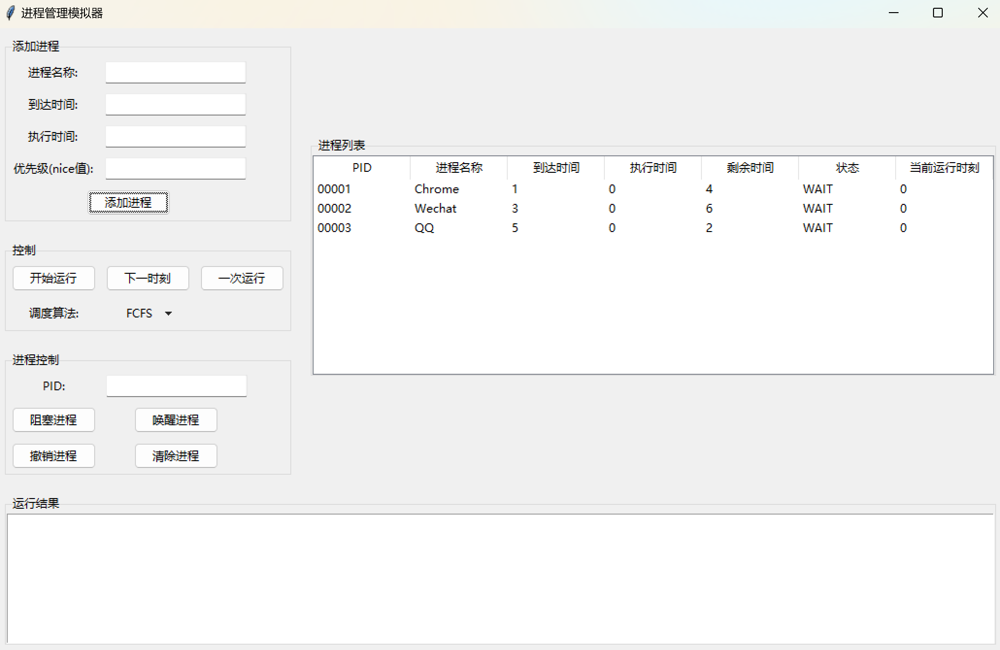
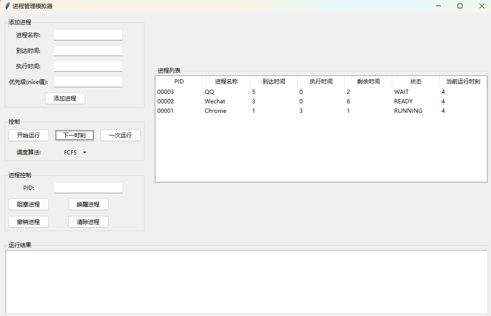
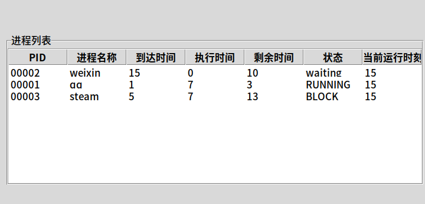
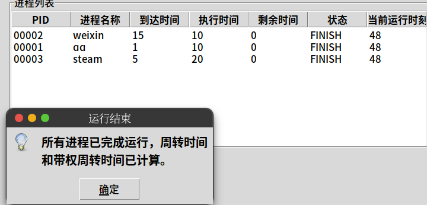
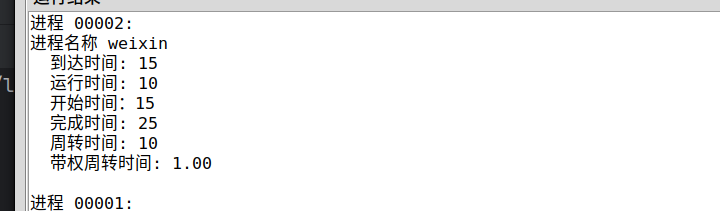

## 项目背景及内容介绍
    
- 进程调度是OS内核的重要部分，调度算法的优秀与否关乎运行效率的高低，我组组员对调度问题颇感兴趣，故做此项目。
- 本项目使用python完成了对FCFS、RR、CFS等调度算法的模拟，另外我们结合界面操作、多线程调用、信号量互斥，  
可以实现对进程的插入，动态运行、阻塞、唤醒、删除等。同时，我们提供了对进程调度的周转时间、平均周转时间的计算  
与展示，可以对比各个算法的差异，分析不同情况下，各个调度算法的效率优劣。

## 项目功能
- 你可以使用CFS、FCFS、RR算法中的任意一种，去模拟进程调度，你只需给出进程名称，到达时间，所需要的时间
- 你可以选择一步步的运行，观察每一时间片，各个进程的变化，也可以选择一次全部运行，动态观察进程变化。
- 在运行的同时，你可以选择阻塞任何一个正在运行的进程，让其停下，当然，随后你可以将其唤醒。你也可以执行删除。
- 最后在运行结束后，你可以看到有关周转时间、平均周转时间等的计算结果，你可以比较三个算法的不同，观察每个调度算法的特点，  
分析各个算法在不同数据下的性能表现。

## 项目亮点
并非简单的模拟计算
1. 可以看到进程的动态执行过程
    - 使用time.sleep()模拟真实的时间消耗，动态的在界面上刷新进程运行情况
2.  可以在执行“运行进程“的代码块的同时，允许动态的阻塞和唤醒进程。
    - 借助thread函数，引入线程来实现。
3.  引入了信号量机制
    - 避免"阻塞"、"唤醒"等操作和“运行”同时操作运行队列，造成数据不一致，所以引入信号量，解决此问题。
4. 良好的扩展性
    - 创建并定义了一个抽象算法类，并且有SCheduler类作为control接口，如果我想添加一个新的调度算法实现模拟，  
    很清晰地可以扩展完成，实现与界面的连接等逻辑功能。

## 代码层次结构

1. 实体层
    - Process 进程块实体 
    - Schedule抽象类，所有算法类都继承并实现里面相应的函数
2. 界面层
    - main_GUI 界面，支持使用者通过界面交互实现直接插入，动态的删除、唤醒、阻塞进程，并可以挑选使用相应的算法，查看运行结果等。
3. 算法层
    - FCFS
        该类继承Schedule，实现相应的抽象方法，实现对先来先服务算法的模拟。
    - RR
        该类继承Schedule，实现相应的抽象方法，实现对轮转调度算法的模拟。
    - CFS
        该类继承Schedule，实现相应的抽象方法，实现对CFS调度算法的模拟。
4. 控制层
    - schelder 类，与界面直接交互，处理界面发来的请求，并调用相应的算法。

## 项目具体功能及演示

1.  添加三个进程：Chrome、Wechat、QQ。到达时间、需要执行时间如图所示:

- 

2. 运行至4时刻，Wechat进程已到达，处于READY状态，Chrome进程还需运行一个时间片

- 

3. 阻塞进程的演示，以另外一个运行为例，这里阻塞了steam(00003)进程：

- 

4. 随后唤醒steam(00003)进程， 运行结束:

- 

5. 运行结果显示，以00002进程为例：

- 

